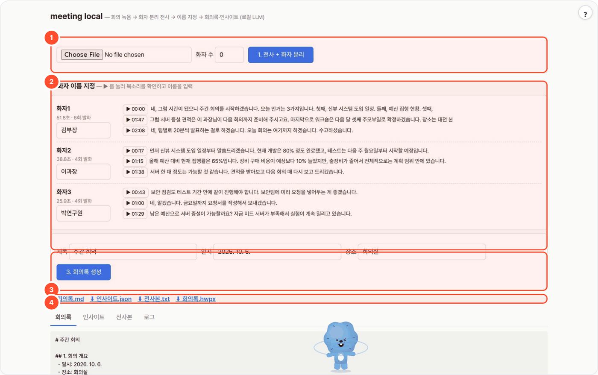

# meeting-local — 회의 녹음 → 화자 분리 전사 → 회의록·인사이트 (로컬 LLM)

> 녹음을 전사하고 화자를 나눕니다. 화자 이름과 회의 정보를 확인한 뒤 주제별 인사이트와 회의록을 만듭니다. kordoc-local 이 옆에 있으면 한컴에서 열리는 HWPX 도 생성합니다.



## 무엇을 하나

- 폐쇄망 안에서 **전사(faster-whisper) → 화자 분리(sherpa-onnx, HF 토큰 불필요) → 화자 이름 지정 → 주제별 인사이트 → 회의록**까지 만듭니다.
- 회의록은 kordoc 회의록 프리셋 Markdown으로 나오고, 옆에 kordoc-local 이 있으면 **HWPX** 까지 뽑습니다.
- 서버 쪽 LLM(Ollama·vLLM)에 환경변수 하나로 붙고, ASR·화자분리 모델은 번들에 동봉해 인터넷 없이 돕니다.
- 다른 도구가 음성 입력에 쓰는 **STT API**(`/v1/audio/transcriptions`)도 제공합니다.
- **의존성**: Python 3.10~3.12, ffmpeg. pip 패키지 2개(faster-whisper, sherpa-onnx) + 모델 파일(화자분리 35MB, whisper 0.5~3GB).
- **사람 개입 지점**: 화자별 발췌 2~3개를 ▶ 로 들어보고 이름만 입력. 나머지는 자동.

## 사용 방법

화면의 번호: **①** 녹음 업로드(파일과 예상 화자 수) · **②** 화자 확인(발췌 음성을 듣고 이름 지정) · **③** 회의 정보(제목·일시·장소)와 회의록 생성 · **④** 결과 다운로드(회의록 md·인사이트·전사본·HWPX)

1. **녹음을 올린다 (①)** — 화자 수를 알면 지정하고 `1. 전사 + 화자 분리`를 누릅니다.
2. **화자를 확인한다 (②)** — 발췌 음성과 전사 문장을 비교하고 이름을 입력합니다.
3. **회의록을 만든다 (③ → ④)** — 회의 정보를 입력해 `3. 회의록 생성` 후 결과를 받습니다. 이름·숫자·결정사항은 원문과 대조하세요.

## 예시

합성 회의 녹음으로 실행한 결과입니다(위 화면, 2026-10-06).

입력:

```text
00_meeting.mp3 · 화자 이름: 김부장, 이과장, 박연구원
회의 제목: 주간 회의 · 일시: 2026. 10. 6. · 장소: 회의실
```

출력:

```text
길이 140.0초 · 화자 3명
WORKSPACE/2026-10-06-c359/
  minutes.md · minutes.hwpx · insights.json · transcript.json · transcript.txt · speakers.json
액션아이템 3개: 보안 점검 요청서 제출 · 서버 증설 견적 보고 · 팀별 발표 자료 준비
```

> 화자 분리와 전사에는 오류가 생길 수 있습니다. 이 실행의 전사본에도 단어 오인식이 있어 회의록을 원문과 대조해야 합니다.

## 설치·실행

```bash
bash setup.sh                                       # venv·모델·LLM 탐색·selftest·웹 서버(8767)
WHISPER_MODEL=small bash setup.sh                   # 맥/CPU PoC (기본 large-v3 는 GPU 서버용)
LLM_BASE_URL=http://gpu:8000/v1 bash setup.sh       # 기존 vLLM 서버 사용
bash setup.sh stop

# CLI
venv/bin/python app.py --cli 회의.m4a --speakers 3 --names "김부장,이과장,박연구원" --title "주간회의" --date "2026. 10. 4."
venv/bin/python selftest.py                         # 모델·LLM 없이 결정적 부분 검증
```

[agent-page-portal](https://github.com/gggg8657/agent-page-portal)에서 띄우면 포털이 포트(8767)·`WORKSPACE`·LLM 설정(로컬 Ollama `gemma4:31b`)·`WHISPER_DEVICE=cuda`를 넣어 줍니다.

| 환경변수 | 기본 | 설명 |
|---|---|---|
| `LLM_API` | `ollama` | `ollama` / `openai` |
| `LLM_BASE_URL` | `http://localhost:11434` / `:8000/v1` | LLM 서버 |
| `LLM_MODEL` | `qwen3:8b` | UI에서 변경 가능. 포털 실행 시 로컬 Ollama `gemma4:31b` |
| `LLM_API_KEY` | | OpenAI 호환 서버 키 |
| `WHISPER_MODEL` | `large-v3` | `tiny/base/small/medium/large-v3` (CPU면 medium 이하 권장) |
| `WHISPER_COMPUTE` | (자동) | 비우면 cuda→`float16`, cpu→`int8` |
| `WHISPER_DEVICE` | `auto` | `cuda` / `cpu` — `cuda` 면 처음 받아쓸 때 여유 메모리가 가장 큰 GPU 를 고름(`gpu_pick.py`) |
| `GPU_POOL` / `GPU_IDLE_UNLOAD_S` | (전부) / `600` | GPU 후보 제한 / 이 초 동안 안 쓰면 Whisper 를 내려 VRAM 반환(다음에 다시 고름, 0 이면 안 내림) |
| `DIAR_THRESHOLD` | `0.5` | 화자 클러스터링 민감도 (낮을수록 화자 수 ↑) |
| `CHUNK_SEC` | `600` | LLM 주제 분할 실패 시 인사이트 창(초) |
| `NUM_CTX` | `16384` | Ollama 컨텍스트 |
| `PORT` | `8767` | |
| `WORKSPACE` | `./_workspace` | 실행 결과 폴더 |
| `MODELS_DIR` | `./models` | 화자분리·whisper 모델 |
| `KORDOC_URL` | `http://localhost:8766` | 윤문하기(kordoc-local) |

**STT API** (다른 도구가 음성 입력에 씀): `POST /v1/audio/transcriptions` — multipart `file` 또는 JSON `{"file": "<base64>"}` → `{"text": "..."}` (한국어, 로드된 faster-whisper 재사용).

웹 UI API: `POST /api/run`(업로드 → 전사·화자 분리, 진행 스트림) · `POST /api/finalize/<run>`(이름·회의 정보 → 인사이트·회의록) · `GET /api/runs` · `GET /api/runs/<run>` · `GET /api/runs/<run>/clip?s=&e=`(발췌 음성) · `GET /api/runs/<run>/minutes.md|minutes.hwpx|insights.json|transcript.txt|transcript.json` · `GET /api/models` · `POST /api/polish`(윤문).

## 파이프라인

| 단계 | 도구 | LLM |
|---|---|---:|
| 변환 | ffmpeg → 16 kHz mono wav | 0 |
| 전사 | faster-whisper (ko, VAD, 단어 타임스탬프) | 0 |
| 화자 분리 | sherpa-onnx: pyannote-segmentation-3.0 ONNX + 3D-Speaker CAM++ 임베딩 → 클러스터링 | 0 |
| 병합 | 세그먼트·단어 단위로 겹침 최대 화자 배정, 등장 순 `화자1,2,3…` | 0 |
| 이름 지정 | UI: 화자별 발췌 ▶ 듣고 이름 입력 → 전체 치환 (나중에 재지정 가능) | 0 |
| 주제 분할 | 발화 목록 → 주제 3~8개 (실패 시 10분 창) | 1 |
| 인사이트 | 주제마다 핵심·근거·쟁점·후속 4줄 | 주제 수 |
| 회의록 | 개요·안건별 논의·결정사항·액션아이템 표·다음 회의 | 1 |
| HWPX | `kordoc generate --preset 회의록` + validate (kordoc-local 이 옆에 있을 때) | 0 |

결과는 `WORKSPACE/<run>/` (audio.wav, transcript.json, speakers.json, insights.json, minutes.md, minutes.hwpx).

## 폐쇄망 반입

```bash
./pack.sh                    # linux-x64 / py3.11 휠 + 화자분리 모델 + whisper large-v3 (≈3GB) → dist-offline/*.tar.gz
WHISPER_MODEL=medium ./pack.sh
```

서버: Python 3.11, ffmpeg 필요. 번들 안 `INSTALL.md` 참고. `HF_HUB_OFFLINE=1` 로 모델 다운로드 시도를 차단.
GPU 전사는 CUDA 12 + cuDNN 9 (CTranslate2). 없으면 `WHISPER_DEVICE=cpu`.

## 한계·메모

- 화자 분리 정확도는 마이크 하나로 녹음한 회의에서 떨어진다. 화자 수를 알면 UI에서 지정하는 편이 낫다.
- 전사본의 이름·숫자 오인식은 LLM이 문맥으로 고치지만 지어내지는 않도록 프롬프트에 묶어 뒀다(`(확인 필요)` 표기).
- 1시간 녹음 기준 CPU medium 전사 ≈ 10~20분, GPU large-v3 ≈ 2~3분.

### ✍ 윤문하기
회의록 아래(저장된 minutes.md 를 윤문해 덮어쓰고 원문은 minutes_orig.md, HWPX 도 다시 생성)에 "윤문하기" 막대(가볍게·보통·적극). kordoc-local 의 글 윤문 API(`KORDOC_URL`, 기본 `http://localhost:8766`)를 부르며, kordoc 이 안 떠 있으면 막대가 숨는다. 숫자·날짜·고유 표기가 바뀐 곳은 원문 유지, "바뀐 곳 보기"로 어절 단위 비교.

## 출처·감사 (Credits)

- [faster-whisper](https://github.com/SYSTRAN/faster-whisper) (MIT) + Whisper CT2 가중치 (MIT, [OpenAI Whisper](https://github.com/openai/whisper))
- [sherpa-onnx](https://github.com/k2-fsa/sherpa-onnx) (Apache-2.0) — 화자 분리: pyannote/segmentation-3.0 ONNX (MIT), 3D-Speaker CAM++ (Apache-2.0)
- ffmpeg (LGPL/GPL, 시스템 프로그램), 선택: [kordoc](https://github.com/chrisryugj/kordoc) (MIT, chrisryugj)
- **LLM 실행** — Ollama API 또는 OpenAI 호환 API 로 호출합니다(모델 가중치는 동봉하지 않음). 기본 배포는 [Ollama](https://github.com/ollama/ollama) (MIT) 위의 Google [Gemma](https://ai.google.dev/gemma) `gemma4:31b` — 모델 이용 조건은 Gemma 배포처 참고.
- 이 도구는 [agent-page-portal](https://github.com/gggg8657/agent-page-portal) 에 연결해 쓰도록 만들었습니다(단독 실행도 됨).

저작권 표기·전체 목록은 `NOTICE` 를 보세요.

## 라이선스

MIT License — Copyright (c) 2026 gggg8657. `LICENSE` 참고.
